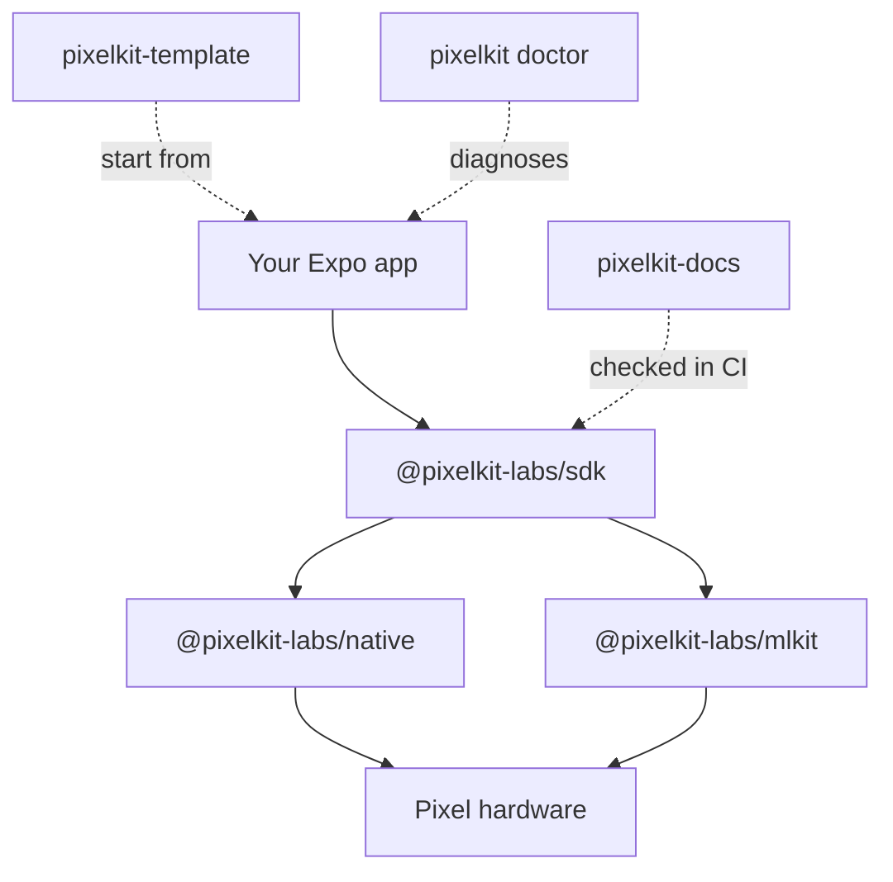

<h1 align="center">PixelKit Labs</h1>

<p align="center">
PixelKit: an SDK, a reference app, and developer tools for building Expo and
  React Native applications on Google Pixel devices.
</p>

<p align="center">
  <a href="https://pixelkit-labs.github.io/pixelkit-docs/">Documentation</a>
  &middot;
  <a href="https://github.com/PixelKit-Labs/pixelkit-template">Start from the template</a>
  &middot;
  <a href="https://www.npmjs.com/org/pixelkit-labs">npm</a>
</p>

## What PixelKit is

PixelKit is an SDK for building Expo and React Native applications on Google Pixel devices. It
provides typed React hooks for the CPU, GPU and TPU, device sensors, radios, secure hardware, camera and audio, display and
power telemetry, haptics, on-device AI, and Cloud AI.

Each hook calls a native Android API through one of two Kotlin Expo Modules and returns typed React
state. Every value also reports where it came from: `hardware`, `derived`, or `unavailable`. When a
reading cannot be taken, the hook returns `null` instead of a placeholder, so an app never shows a
number the device did not produce.

## What you can build with it

| Area | Examples |
| :--- | :--- |
| **CPU, GPU and TPU** | CPU core topology, per-core clocks and load; GPU identity, frame pacing and jank; which accelerator on-device AI runs on, and how fast |
| **Memory, power and thermals** | Memory pressure, thermal headroom, battery health and charging, system tracing |
| **Sensors and actuators** | Motion and pressure, camera and vendor extensions, microphone array, torch, haptics |
| **Radios and security** | Bluetooth and channel sounding, NFC, Wi-Fi 7 and RTT, satellite, GNSS, biometrics, hardware keystore, Play Integrity |
| **System and media** | Display, audio and spatial audio, network and cellular, video, media library |
| **AI** | Gemini Nano on AICore, ML Kit vision and language, speech, embeddings, cloud Gemini, AppFunctions |
| **Pixel Pro hardware** | The HiLight camera-bar LEDs, UWB ranging |

## How the pieces fit



| Repository | What it is |
| :--- | :--- |
| **[pixelkit-sdk](https://github.com/PixelKit-Labs/pixelkit-sdk)** | The SDK: the hooks, the two Kotlin Expo Modules, unit tests, and on-device test recipes |
| **[pixelkit-template](https://github.com/PixelKit-Labs/pixelkit-template)** | A working Expo app with a screen for each hook. Press **Use this template** to start. |
| **[pixelkit-docs](https://github.com/PixelKit-Labs/pixelkit-docs)** | The API reference and guides, and the hook definitions the SDK is checked against in CI |
| **[pixelkit-cli](https://github.com/PixelKit-Labs/pixelkit-cli)** | `pixelkit doctor`: checks the device, the build and the packages when readings come back empty |

## How it is built

- **Nothing is simulated.** There is no `simulated` value in the type system, so a made-up reading
  cannot be represented.
- **Documented, or it does not build.** CI fails if a hook is exported without documentation, or
  documented with a field its type does not have.
- **Verified on real hardware.** Unit tests and cross-repository checks run on every push, and
  ARTEMIS drives the reference app on a real Pixel.
- **Observable.** Every call to hardware, the network or a native module is traced, timed and logged.

## Requirements

Android only, built for the Pixel 11 Pro, Pro Fold and Pro XL. Other Android devices report
`unavailable` where the hardware is missing. PixelKit needs a development build
(`npx expo run:android` or an EAS development profile), not Expo Go, because its native modules must
be compiled into the app. Expo SDK 57, React Native 0.86.

## Get started

```bash
npx expo install @pixelkit-labs/sdk @pixelkit-labs/native
```

```tsx
import { useCPU } from '@pixelkit-labs/sdk';

const cpu = useCPU(); // cpu.source: 'hardware' | 'derived' | 'unavailable'
```

<p align="center">
  <a href="https://pixelkit-labs.github.io/pixelkit-docs/">Documentation</a>
  &middot;
  <a href="https://github.com/PixelKit-Labs/pixelkit-template">Template</a>
  &middot;
  <a href="https://github.com/PixelKit-Labs/pixelkit-sdk/issues/new?labels=bug">Report a bug</a>
</p>
